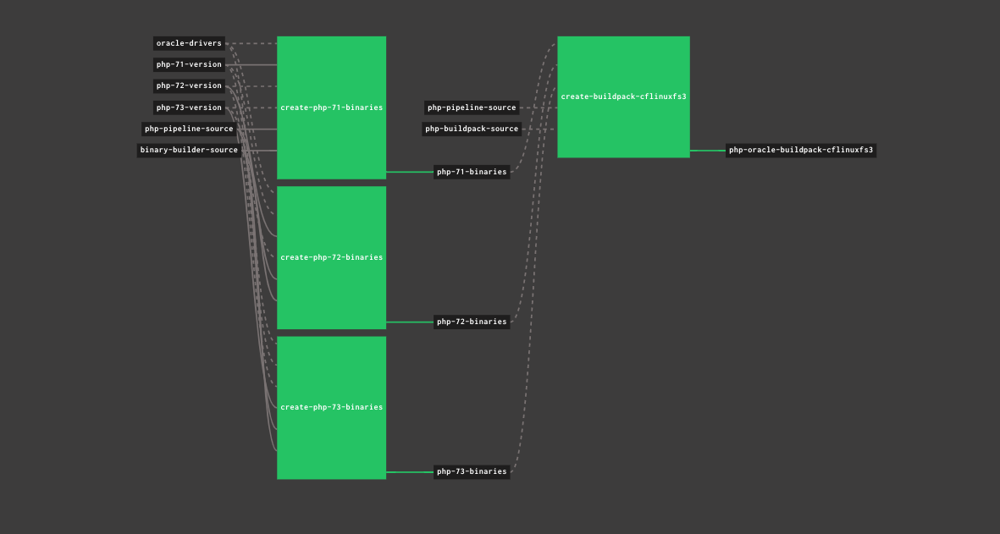

# php-buildpack-pipeline

## Purpose
This repo contains a Concourse pipeline for building an offline copy of the current version of the Cloud Foundry
PHP Buildpack which includes Oracle database drivers for applications which need access to an Oracle 
database.  It can easily be modified to create online buildpacks if you prefer.  For more detailed information
about building custom buildpacks, please refer to the official [Cloud Foundry Documentation](https://docs.pivotal.io/pivotalcf/2-2/buildpacks/developing-buildpacks.html).

This Pipeline Takes 3 resources as input:
* An S3 bucket containing a `.tar.gz` file copy of the Oracle 12c drivers and SDK
- This repo's source
- The Cloud Foundry Binary Builder - used to bind the PHP Binaries used in the Buildpack
- The Official Cloud Foundry PHP Buildpack Source

The built PHP Buildpack for cflinuxfs3 which includes the Oracle drivers will be stored in the same S3 bucket where the Oracle drivers are stored.



## Using The Pipeline

### Building your Oracle Driver zip file
* Download zip version of Oracle Instant Client Basic for Linux x86-64 (64-bit) version 12.x from [Oracle](http://www.oracle.com/technetwork/topics/linuxx86-64soft-092277.html) 
- Download zip version of Oracle Instant Client SDK for Linux x86-64 (64-bit) version 12.x from [Oracle](http://www.oracle.com/technetwork/topics/linuxx86-64soft-092277.html)
- Extract both zip files to same folder.  The SDK package should make an SDK subdirectory
- Tar and gzip the root directory together into a file oracle-instantclient-12-with-sdk-v(.*).tar.gz.  There
  should be a version stamp that the S3 resource can sort after the v in the filename.  The end the 
  contents should look something like this:
  ```bash
  $ tar ztvf oracle-instantclient-12-with-sdk-v201808311900.tar.gz
  -rw-rw-r--  0 bthelen staff     212 Jul  7  2014 ./._BASIC_README
  -rw-rw-r--  0 bthelen staff     440 Jul  7  2014 BASIC_README
  -rwxrwxr-x  0 bthelen staff     212 Jul  7  2014 ./._adrci
  -rwxrwxr-x  0 bthelen staff   29404 Jul  7  2014 adrci
  -rwxrwxr-x  0 bthelen staff     212 Jul  7  2014 ./._genezi
  -rwxrwxr-x  0 bthelen staff   43944 Jul  7  2014 genezi
  lrwxr-xr-x  0 bthelen staff       0 Aug 30 13:44 libclntsh.so -> libclntsh.so.12.1
  -rwxrwxr-x  0 bthelen staff     212 Jul  7  2014 ./._libclntsh.so.12.1
  -rwxrwxr-x  0 bthelen staff 58793741 Jul  7  2014 libclntsh.so.12.1
  -rwxrwxr-x  0 bthelen staff      212 Jul  7  2014 ./._libclntshcore.so.12.1
  -rwxrwxr-x  0 bthelen staff  6990875 Jul  7  2014 libclntshcore.so.12.1
  -r-xr-xr-x  0 bthelen staff      212 Jul  7  2014 ./._libipc1.so
  -r-xr-xr-x  0 bthelen staff  1768370 Jul  7  2014 libipc1.so
  -r-xr-xr-x  0 bthelen staff      212 Jul  7  2014 ./._libmql1.so
  -r-xr-xr-x  0 bthelen staff   544150 Jul  7  2014 libmql1.so
  -r-xr-xr-x  0 bthelen staff      212 Jul  7  2014 ./._libnnz12.so
  -r-xr-xr-x  0 bthelen staff  6213011 Jul  7  2014 libnnz12.so
  -rwxrwxr-x  0 bthelen staff      212 Jul  7  2014 ./._libocci.so.12.1
  -rwxrwxr-x  0 bthelen staff  2576030 Jul  7  2014 libocci.so.12.1
  -rwxrwxr-x  0 bthelen staff      212 Jul  7  2014 ./._libociei.so
  -rwxrwxr-x  0 bthelen staff 109549133 Jul  7  2014 libociei.so
  -r-xr-xr-x  0 bthelen staff       212 Jul  7  2014 ./._libocijdbc12.so
  -r-xr-xr-x  0 bthelen staff    156353 Jul  7  2014 libocijdbc12.so
  -r-xr-xr-x  0 bthelen staff       212 Jul  7  2014 ./._libons.so
  -r-xr-xr-x  0 bthelen staff    337137 Jul  7  2014 libons.so
  -rwxrwxr-x  0 bthelen staff       212 Jul  7  2014 ./._liboramysql12.so
  -rwxrwxr-x  0 bthelen staff    118491 Jul  7  2014 liboramysql12.so
  -r--r--r--  0 bthelen staff       212 Jul  7  2014 ./._ojdbc6.jar
  -r--r--r--  0 bthelen staff   3692096 Jul  7  2014 ojdbc6.jar
  -r--r--r--  0 bthelen staff       212 Jul  7  2014 ./._ojdbc7.jar
  -r--r--r--  0 bthelen staff   3698857 Jul  7  2014 ojdbc7.jar
  -rwxrwxr-x  0 bthelen staff       212 Jul  7  2014 ./._sdk
  drwxrwxr-x  0 bthelen staff         0 Jul  7  2014 sdk/
  -rwxrwxr-x  0 bthelen staff       212 Jul  7  2014 sdk/._demo
  drwxrwxr-x  0 bthelen staff         0 Jul  7  2014 sdk/demo/
  -rwxrwxr-x  0 bthelen staff       212 Jul  7  2014 sdk/._include
  drwxrwxr-x  0 bthelen staff         0 Jul  7  2014 sdk/include/
  -rwxrwxr-x  0 bthelen staff       212 Jul  7  2014 sdk/._admin
  drwxrwxr-x  0 bthelen staff         0 Jul  7  2014 sdk/admin/
  -rw-rw-r--  0 bthelen staff       212 Jul  7  2014 sdk/._ottclasses.zip
  -rw-rw-r--  0 bthelen staff    311555 Jul  7  2014 sdk/ottclasses.zip
  -r-xr-xr-x  0 bthelen staff       212 Jul  7  2014 sdk/._ott
  -r-xr-xr-x  0 bthelen staff       868 Jul  7  2014 sdk/ott
  -rw-rw-r--  0 bthelen staff       212 Jul  7  2014 sdk/._SDK_README
  -rw-rw-r--  0 bthelen staff       436 Jul  7  2014 sdk/SDK_README
  -r-xr-xr-x  0 bthelen staff       212 Jul  7  2014 sdk/admin/._oraaccess.xsd
  -r-xr-xr-x  0 bthelen staff      9141 Jul  7  2014 sdk/admin/oraaccess.xsd
  -r-xr-xr-x  0 bthelen staff       212 Jul  7  2014 sdk/include/._occiData.h
  -r-xr-xr-x  0 bthelen staff     39934 Jul  7  2014 sdk/include/occiData.h
  -r-xr-xr-x  0 bthelen staff       212 Jul  7  2014 sdk/include/._xa.h
  -r-xr-xr-x  0 bthelen staff      9892 Jul  7  2014 sdk/include/xa.h
  -r-xr-xr-x  0 bthelen staff       212 Jul  7  2014 sdk/include/._oci.h
  -r-xr-xr-x  0 bthelen staff    189648 Jul  7  2014 sdk/include/oci.h
  -r-xr-xr-x  0 bthelen staff       212 Jul  7  2014 sdk/include/._ocixmldb.h
  -r-xr-xr-x  0 bthelen staff      7848 Jul  7  2014 sdk/include/ocixmldb.h
  -r-xr-xr-x  0 bthelen staff       212 Jul  7  2014 sdk/include/._ocikpr.h
  -r-xr-xr-x  0 bthelen staff      6494 Jul  7  2014 sdk/include/ocikpr.h
  -r-xr-xr-x  0 bthelen staff       212 Jul  7  2014 sdk/include/._ociextp.h
  -r-xr-xr-x  0 bthelen staff      8953 Jul  7  2014 sdk/include/ociextp.h
  -r-xr-xr-x  0 bthelen staff       212 Jul  7  2014 sdk/include/._ldap.h
  -r-xr-xr-x  0 bthelen staff     44851 Jul  7  2014 sdk/include/ldap.h
  -r-xr-xr-x  0 bthelen staff       212 Jul  7  2014 sdk/include/._oro.h
  -r-xr-xr-x  0 bthelen staff     42866 Jul  7  2014 sdk/include/oro.h
  -r-xr-xr-x  0 bthelen staff       212 Jul  7  2014 sdk/include/._oci8dp.h
  -r-xr-xr-x  0 bthelen staff     10361 Jul  7  2014 sdk/include/oci8dp.h
  -r-xr-xr-x  0 bthelen staff       212 Jul  7  2014 sdk/include/._nzerror.h
  -r-xr-xr-x  0 bthelen staff     36543 Jul  7  2014 sdk/include/nzerror.h
  -r-xr-xr-x  0 bthelen staff       212 Jul  7  2014 sdk/include/._oci1.h
  -r-xr-xr-x  0 bthelen staff      7203 Jul  7  2014 sdk/include/oci1.h
  -r-xr-xr-x  0 bthelen staff       212 Jul  7  2014 sdk/include/._ocidem.h
  -r-xr-xr-x  0 bthelen staff      4048 Jul  7  2014 sdk/include/ocidem.h
  -r-xr-xr-x  0 bthelen staff       212 Jul  7  2014 sdk/include/._ort.h
  -r-xr-xr-x  0 bthelen staff    123766 Jul  7  2014 sdk/include/ort.h
  -r-xr-xr-x  0 bthelen staff       212 Jul  7  2014 sdk/include/._orl.h
  -r-xr-xr-x  0 bthelen staff    158261 Jul  7  2014 sdk/include/orl.h
  -r-xr-xr-x  0 bthelen staff       212 Jul  7  2014 sdk/include/._ociap.h
  -r-xr-xr-x  0 bthelen staff    434446 Jul  7  2014 sdk/include/ociap.h
  -r-xr-xr-x  0 bthelen staff       212 Jul  7  2014 sdk/include/._occiCommon.h
  -r-xr-xr-x  0 bthelen staff     35604 Jul  7  2014 sdk/include/occiCommon.h
  -r-xr-xr-x  0 bthelen staff       212 Jul  7  2014 sdk/include/._ocidfn.h
  -r-xr-xr-x  0 bthelen staff     11782 Jul  7  2014 sdk/include/ocidfn.h
  -r-xr-xr-x  0 bthelen staff       212 Jul  7  2014 sdk/include/._occiAQ.h
  -r-xr-xr-x  0 bthelen staff     11649 Jul  7  2014 sdk/include/occiAQ.h
  -r-xr-xr-x  0 bthelen staff       212 Jul  7  2014 sdk/include/._ocixstream.h
  -r-xr-xr-x  0 bthelen staff    105155 Jul  7  2014 sdk/include/ocixstream.h
  -r-xr-xr-x  0 bthelen staff       212 Jul  7  2014 sdk/include/._occiObjects.h
  -r-xr-xr-x  0 bthelen staff     24778 Jul  7  2014 sdk/include/occiObjects.h
  -r-xr-xr-x  0 bthelen staff       212 Jul  7  2014 sdk/include/._ori.h
  -r-xr-xr-x  0 bthelen staff    102775 Jul  7  2014 sdk/include/ori.h
  -r-xr-xr-x  0 bthelen staff       212 Jul  7  2014 sdk/include/._occi.h
  -r-xr-xr-x  0 bthelen staff      2115 Jul  7  2014 sdk/include/occi.h
  -r-xr-xr-x  0 bthelen staff       212 Jul  7  2014 sdk/include/._occiControl.h
  -r-xr-xr-x  0 bthelen staff     72561 Jul  7  2014 sdk/include/occiControl.h
  -r-xr-xr-x  0 bthelen staff       212 Jul  7  2014 sdk/include/._ociapr.h
  -r-xr-xr-x  0 bthelen staff      6204 Jul  7  2014 sdk/include/ociapr.h
  -r-xr-xr-x  0 bthelen staff       212 Jul  7  2014 sdk/include/._nzt.h
  -r-xr-xr-x  0 bthelen staff     75006 Jul  7  2014 sdk/include/nzt.h
  -r-xr-xr-x  0 bthelen staff       212 Jul  7  2014 sdk/include/._odci.h
  -r-xr-xr-x  0 bthelen staff     30429 Jul  7  2014 sdk/include/odci.h
  -r-xr-xr-x  0 bthelen staff       212 Jul  7  2014 sdk/include/._oratypes.h
  -r-xr-xr-x  0 bthelen staff      6540 Jul  7  2014 sdk/include/oratypes.h
  -r-xr-xr-x  0 bthelen staff       212 Jul  7  2014 sdk/include/._orid.h
  -r-xr-xr-x  0 bthelen staff     15083 Jul  7  2014 sdk/include/orid.h
  -r-xr-xr-x  0 bthelen staff       212 Jul  7  2014 sdk/include/._ocidef.h
  -r-xr-xr-x  0 bthelen staff     43001 Jul  7  2014 sdk/include/ocidef.h
  -r-xr-xr-x  0 bthelen staff       212 Jul  7  2014 sdk/demo/._oraaccess.xml
  -r-xr-xr-x  0 bthelen staff      1227 Jul  7  2014 sdk/demo/oraaccess.xml
  -r-xr-xr-x  0 bthelen staff       212 Jul  7  2014 sdk/demo/._occiobj.typ
  -r-xr-xr-x  0 bthelen staff        60 Jul  7  2014 sdk/demo/occiobj.typ
  -r-xr-xr-x  0 bthelen staff       212 Jul  7  2014 sdk/demo/._cdemo81.c
  -r-xr-xr-x  0 bthelen staff     14783 Jul  7  2014 sdk/demo/cdemo81.c
  -r-xr-xr-x  0 bthelen staff       212 Jul  7  2014 sdk/demo/._occidemod.sql
  -r-xr-xr-x  0 bthelen staff      1966 Jul  7  2014 sdk/demo/occidemod.sql
  -rwxrwxr-x  0 bthelen staff       212 Jul  7  2014 sdk/demo/._demo.mk
  -rwxrwxr-x  0 bthelen staff      4282 Jul  7  2014 sdk/demo/demo.mk
  -r-xr-xr-x  0 bthelen staff       212 Jul  7  2014 sdk/demo/._setuporamysql.sh
  -r-xr-xr-x  0 bthelen staff      6798 Jul  7  2014 sdk/demo/setuporamysql.sh
  -r-xr-xr-x  0 bthelen staff       212 Jul  7  2014 sdk/demo/._occiobj.cpp
  -r-xr-xr-x  0 bthelen staff      4902 Jul  7  2014 sdk/demo/occiobj.cpp
  -r-xr-xr-x  0 bthelen staff       212 Jul  7  2014 sdk/demo/._occidemo.sql
  -r-xr-xr-x  0 bthelen staff      8358 Jul  7  2014 sdk/demo/occidemo.sql
  -r-xr-xr-x  0 bthelen staff       212 Jul  7  2014 sdk/demo/._occidml.cpp
  -r-xr-xr-x  0 bthelen staff      7649 Jul  7  2014 sdk/demo/occidml.cpp
  -rwxrwxr-x  0 bthelen staff       212 Jul  7  2014 ./._uidrvci
  -rwxrwxr-x  0 bthelen staff    227410 Jul  7  2014 uidrvci
  -rw-rw-r--  0 bthelen staff       212 Jul  7  2014 ./._xstreams.jar
  -rw-rw-r--  0 bthelen staff     71202 Jul  7  2014 xstreams.jar
  ``` 
- Store that `.tar.gz` file in your S3 bucket. 

### Add your pipeline to your Concourse 

* Use [fly set-pipeline](https://concourse-ci.org/setting-pipelines.html).   

### Place the newly built Buildpack on your Cloud Foundry foundation

* Use [cf create-buildpack or cf update-buildpack](https://docs.cloudfoundry.org/adminguide/buildpacks.html)
  as per the Cloud Foundry docs.
